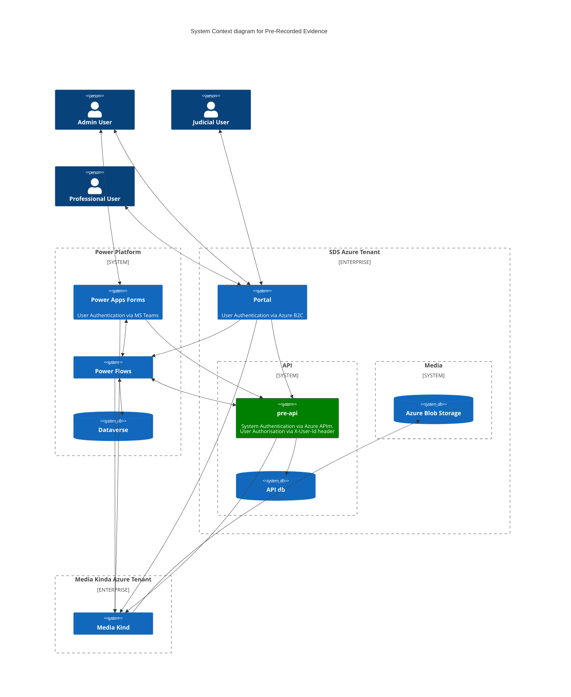

# Pre-Recorded Evidence API (pre-api)

[](https://opensource.org/licenses/MIT) [](https://sonarcloud.io/summary/new_code?id=uk.gov.hmcts.reform%3Apre-api) [](https://sonarcloud.io/summary/new_code?id=uk.gov.hmcts.reform%3Apre-api) [](https://sonarcloud.io/summary/new_code?id=uk.gov.hmcts.reform%3Apre-api) [](https://sonarcloud.io/summary/new_code?id=uk.gov.hmcts.reform%3Apre-api)

## Table of Contents

* [Introduction](#introduction)
  * [Intro to Pre-Recorded Evidence](#bulk-print)
  * [Purpose of pre-api](#send-letter-service)
  * [Documentation](#documentation)
  * [PRE System Diagram](#pre-system-diagram)
  * [Other PRE Repositories](#other-pre-repositories)
  * [What's inside](#whats-inside)
  * [Plugins](#plugins)
* [Building, Deploying and Running the Application Locally](#building-deploying-and-running-the-application-locally)
  * [Prerequisites](#prerequisites)
  * [Building the application](#building-the-application)
  * [Running the database locally with Docker](#running-the-database-locally-with-docker)
* [Running the Tests Locally](#running-the-tests-locally)
  * [Running the Unit Tests](#running-the-unit-tests)
  * [Running the Integration Tests](#running-the-integration-tests)
  * [Running the Functional Tests](#running-the-functional-tests)
  * [Running the Smoke Tests](#running-the-smoke-tests)
* [Developing for the Pre-Recorded Evidence API](#developing-for-the-pre-recorded-evidence-api)
  * [Loading the Local Database with Test Data](#loading-the-local-database-with-test-data)
  * [How to generate a Power Platform Custom Connector](#how-to-generate-a-power-platform-custom-connector)
  * [Running the Crons](#running-the-crons)
* [Troubleshooting](#troubleshooting)
  * [Common Issues](#common-issues)
* [License](#license)

## Introduction

### Intro to Pre-Recorded Evidence System

The Pre-Recorded Evidence (PRE) system is a new service that allows the capturing of a video recorded hearing or testimony,
and allows this recording to be securely shared to advocates, or played back in court. You can learn more about the service
[here](https://tools.hmcts.net/confluence/display/S28/Pre-Recorded+Evidence).

### Purpose of pre-api in the System

This code repository contains the source code for the Pre-Recorded Evidence API (pre-api).

pre-api is a Java Spring Boot application that serves as a backend API for both the PRE PowerApps app and the PRE Portal.

### Documentation

The API hosts numerous endpoints, which are [documented in Swagger](https://hmcts.github.io/cnp-api-docs/swagger.html?url=https://hmcts.github.io/cnp-api-docs/specs/pre-api.json#/).
If running PRE API locally, you can access the Swagger UI at [http://localhost:4550/swagger-ui/index.html](http://localhost:4550/swagger-ui/index.html).

### PRE System Diagram

This diagram gives an overview of the PRE system which the pre-api connects to in its current state (not yet live).


### Other PRE Repositories
 * [PRE Power Platform Frontend](https://github.com/hmcts/pre-power-platform)
 * [PRE Shared Infrastructure](https://github.com/hmcts/pre-shared-infrastructure)
 * [PRE Function Apps](https://github.com/hmcts/pre-functions)
 * [PRE Portal](https://github.com/hmcts/pre-portal)

### What's inside

The repository is a working application. It contains:
 * application code
 * common plugins and libraries
 * docker setup
 * automatically publishes API documentation to [hmcts/cnp-api-docs](https://github.com/hmcts/cnp-api-docs)
 * code quality tools already set up
 * MIT license and contribution information
 * Helm chart using chart-java.

The application exposes health endpoint (http://localhost:4550/health).

## Plugins

The repository contains the following plugins:

  * checkstyle

    https://docs.gradle.org/current/userguide/checkstyle_plugin.html

    Performs code style checks on Java source files using Checkstyle and generates reports from these checks.
    The checks are included in gradle's *check* task (you can run them by executing `./gradlew check` command).

  * pmd

    https://docs.gradle.org/current/userguide/pmd_plugin.html

    Performs static code analysis to finds common programming flaws. Included in gradle `check` task.


  * jacoco

    https://docs.gradle.org/current/userguide/jacoco_plugin.html

    Provides code coverage metrics for Java code via integration with JaCoCo.
    You can create the report by running the following command:

    ```bash
      ./gradlew jacocoTestReport
    ```
    The report will be created in build/reports subdirectory in your project directory.
  * io.spring.dependency-management
    https://github.com/spring-gradle-plugins/dependency-management-plugin
    Provides Maven-like dependency management. Allows you to declare dependency management
    using `dependency 'groupId:artifactId:version'`
    or `dependency group:'group', name:'name', version:version'`.
  * org.springframework.boot
    http://projects.spring.io/spring-boot/
    Reduces the amount of work needed to create a Spring application
  * org.owasp.dependencycheck
    https://jeremylong.github.io/DependencyCheck/dependency-check-gradle/index.html
    Provides monitoring of the project's dependent libraries and creating a report
    of known vulnerable components that are included in the build. To run it
    execute `gradle dependencyCheck` command.

  * com.github.ben-manes.versions

    https://github.com/ben-manes/gradle-versions-plugin

    Provides a task to determine which dependencies have updates. Usage:

    ```bash
      ./gradlew dependencyUpdates -Drevision=release
    ```

## Building, Deploying and Running the Application Locally

### Prerequisites

#### Setting Environment Variables

> **Note** ℹ️
> pre-api requires many environment variables to be set in order to run. You can get an idea of what they are by looking at the
> `.env.local` file in the root of the project.
---
To run the application locally, you need to set several environment variables. Follow these steps:

1. **Create a `.env` file.**
   In the root of the project, create a file named `.env`.

2. **Get the variable values.**
   Ask one of the [PRE developers](https://github.com/orgs/hmcts/teams/pre-rec-evidence) for the required environment variable values and add them to your `.env` file.

3. **Load the variables.**
   Run the following command in your terminal to load the variables from your `.env` file into your current shell session:

   ```bash
   export $(grep -v '^#' .env | xargs -0)
   ```

> **Note** ℹ️
> This command loads all the environment variables defined in your `.env` file (ignoring any lines that start with `#`, which are comments)
and exports them into your current session. This makes the variables available to the application when you run it
Without the command, the application won't have the values it needs to function correctly.

### Building the application

> **Note** ℹ️
> The project uses [Gradle](https://gradle.org) as a build tool. It already contains
`./gradlew` wrapper script, so there's no need to install gradle.

To build the project execute the following command:

```bash
  ./gradlew build
```

### Running the database locally with Docker

1. **Build the Docker image for database:**

   ```bash
   docker-compose build
   ```

    This command will build the Docker image for the database using the `docker-compose.yml` in the root of the project.

2. **Start the database the application needs:**

   ```bash
   docker-compose up --detach
   ```

   This will start the database container (in the background, hence the --detach). As well as the adminer container
which is a web interface for managing the database and can be used or ignored.

### Start the application

Once the database is up and running you can start the application.

3. **Start the application with Gradle:**

   ```bash
   ./gradlew bootRun
   ```

   This will start the application directly from the source code (no need for JAR or image). Gradle may show the task as
83% EXECUTING—this is normal and just means the application is running and waiting for you to stop it.

   **Or Start the application with IntelliJ:**
    > **Note** ℹ️
    > Ask one of the [PRE developers](https://github.com/orgs/hmcts/teams/pre-rec-evidence) for
    > a `.env` file to put at the route of your project

    Intellij will not have the environment variables in its context so you will need to set them up in the run configuration.

    - Right click on the `Application` class (the one with the `@SpringBootApplication` annotation) and hover over "More Run/Debug"
    - Select "Modify Run Configuration"
    - In the "Run/Debug Configurations" window, select more options and make sure the "Environment Variables" field is ticked.
    - Click on the little folder next to the "Environment Variables" field
    - Navigate to your `.env` file and select it.

    Now you can run the application from IntelliJ:
    Right click the Application class (the one with the `@SpringBootApplication` annotation) and select "Run 'Application'".
    This will start the application in IntelliJ.

   **Or Start the application with JAR:**
   ```bash
   ./gradlew bootJar
   ```

   This will create a JAR file in the `build/libs` directory. You can run it with:

   ```bash
   java -jar build/libs/pre-api.jar
   ```

   **Or Start the application with a debugger:**
    To run with a debugger attached, you can run natively in an IDE, or attach:

    ```bash
    ./gradlew clean build bootRun --debug-jvm
    ```

  Let it run until it hangs with a listening message. Then in IntelliJ, select the Java process from Run > Attach to Process.

4. **No matter which method chosen, check if the application is running:**

   Call the health endpoint:

   ```bash
   curl http://localhost:4550/health
   ```

   You should see a response similar to:

   ```
   {"status":"UP","diskSpace":{"status":"UP","total":249644974080,"free":137188298752,"threshold":10485760}}
   ```
    This indicates that the application is running healthily.

## Running the Tests Locally

### Running the Unit Tests

#### With the Command Line

To run the unit tests with the command line, execute the following command:

```bash
  ./gradlew test
```

This will run all the unit tests in the project and generate a report in `build/reports/tests/test/index.html`.
You can open this file in your browser to see the test results.

#### With IntelliJ

Right-click on the `src/test` directory in IntelliJ and select "Run 'Tests in 'pre-api.test'". This will run all the unit tests in the project.
You can also run individual test classes or methods by right-clicking on them and selecting "Run".

### Running the Integration Tests

To run integration tests, a docker image is needed for the
postgres testcontainers database (temp database for testing). This will be done during the
running of the tests.

#### Pre-requisites
Testcontainers (test helper library) needs the HMCTS postgres image for the test database it sets up. For this to pull
from HMCTS Azure Container Registry (ACR) you must login to the ACR first:

```bash
az login # if not logged in already
az acr login --name hmctspublic
```

#### With the Command Line
To run the integration tests with the command line, execute the following command:

```bash
  ./gradlew integration
```

This will run all the integration tests in the project and generate a report in `build/reports/tests/integration/index.html`.

#### With IntelliJ

Right-click on the `src/integrationTest` directory in IntelliJ and select "Run 'Tests in pre-api.IntegrationTest'". This will run all the integration tests in the project.

### Running the Functional Tests

#### Prerequisites

To run the functional tests, you need to have the application running locally. Follow the steps in the
[Running the Application with Docker](#running-the-application-with-docker) section to start the application.

#### With the Command Line
The functional tests need access to these four environment variables:

MEDIA_KIND_SUBSCRIPTION
MEDIA_KIND_TOKEN
GOV_NOTIFY_API_KEY=
GOV_NOTIFY_API_KEY_TEST

Export the variables above or alternatively set up all environment variables (including the four above) by following the
[Setting Environment Variables](#setting-environment-variables) section.

To run the functional tests, execute the following command:

```bash
  ./gradlew functional
```
#### With IntelliJ

Right-click on the `src/functionalTest` directory in IntelliJ and select "Run 'Tests in pre-api.functionalTest'". This will run all the
functional tests in the project.

The test results will be displayed in the IntelliJ console. You can also view the test reports in the `build/reports/tests/functional/index.html` file.

### Running the Smoke Tests

#### With the Command Line

The smoke tests run the command:
```bash
  ./gradlew smoke
```

This will run all the smoke tests in the project and generate a report in `build/reports/tests/smoke/index.html`.

#### With IntelliJ

Right-click on the `src/smokeTest` directory in IntelliJ and select "Run 'Tests in pre-api.smokeTest'".
This will run all the smoke tests in the project.

## Developing for the Pre-Recorded Evidence API

You will need to have your laptop ready for DTS development. This includes:
- Setting up your laptop with DTS basics, see the Confluence page here
  [Mac Developers](https://tools.hmcts.net/confluence/display/DATS/EUC+Advice+for+%28NonAdmin%29Macbook+Developers)
- You will need SSH key in GitHub that is authorised for SSO access to HMCTS repos. See the
  [GitHub Docs: Authorizing an SSH key for use with SAML single sign-on](https://docs.github.com/en/authentication/connecting-to-github-with-ssh/authorizing-an-ssh-key-for-use-with-saml-single-sign-on)
  for more information.
- You will need to be a contributor to PRE or get help from one of the PRE developers(https://github.com/orgs/hmcts/teams/pre-rec-evidence)

### Loading the Local Database with Test Data

To load schemas and test data into your local postgresql database:

1. **Start the database container**
   ```bash
   docker-compose up --detach
   ```

2. **Run the data load script**
   ```bash
   bash docker/database/local/load_data_into_local_db.sh
   ```
   > **Note** ℹ️
   > You may need to make the script executable first with `chmod +x ./docker/database/local/load_data_into_local_db.sh`

This will:
- Apply all SQL migration scripts to the `pre-api-db` database container.
- Clean up temporary files.

Your local database will now be ready for you to play around with.

If it all goes wrong, simply clean up Docker and start again:

```bash
docker-compose rm
```

This clears stopped containers correctly.

### How to generate a Power Platform Custom Connector
Copy the [Swagger v2 spec](https://raw.githubusercontent.com/hmcts/pre-api/master/pre-api-stg.yaml) and paste it into
the [Power Platform Custom Connector](https://make.powerautomate.com/environments/3df85815-859a-e884-8b20-6a6dac1054a1/connections/custom) edit page. There will need to be a connector for prod and staging. The swagger spec is automatically updated in each PR.


### Running the Crons

You can manually run a cron task from the cli:

1. You will need to make sure your environment variables are set up. You can do this by following the instruction in the
[Setting Environment Variables](#setting-environment-variables) section.
2. The database must be running (as it needs the cron user info stored there). You can do this by following the instruction in the
[Running the Application database with Docker](#running-the-application-database-with-docker) section.
3. Run the task you are interested in by JAR:
```bash
  ./gradlew bootJar
```
TASK_NAME=[task] java -jar pre-api.jar run
E.g.
TASK_NAME=CleanupLiveEvents java -jar pre-api.jar

or by source code:
```
TASK_NAME=CheckForMissingRecordings ./gradlew bootRun
```

## Troubleshooting

### Common Issues

#### Application Fails to Start after Gradle BootRun
If the application fails to start after running `./gradlew bootRun`, check the following:

- **Check your environment variables:**
  Ensure all required variables are set and have the correct values.

- **How to set them:**
  Refer to the [Setting Environment Variables](#setting-environment-variables) section for detailed instructions on how to configure your environment.

- **Tip:**
  If you are using IntelliJ, make sure your run configuration includes the necessary environment variables in the run
configurations. If running from the terminal, confirm you have loaded your `.env` file as described.

#### Cloning or Pushing Issues (Git)

If you encounter authentication errors when cloning or pushing to the repository,
it may be due to your SSH key not being configured for GitHub SSO.

- **Check your SSH key:**
  Ensure your SSH key is added to your GitHub account.

- **Enable SSO for your SSH key:**
  HMCTS uses SSO SAML, you must authorize your SSH key for SSO access.
  Go to [GitHub SSH keys settings](https://github.com/settings/keys), find your key, and click **"Configure SSO"**
dropdown and authorise for HMCTS

- **More info:**
  See [GitHub Docs: Authorizing an SSH key for use with SAML single sign-on](https://docs.github.com/en/authentication/connecting-to-github-with-ssh/authorizing-an-ssh-key-for-use-with-saml-single-sign-on).

Once SSO is enabled for your SSH key, retry your Git operations.

## License
This project is licensed under the MIT License - see the [LICENSE](LICENSE) file for details

