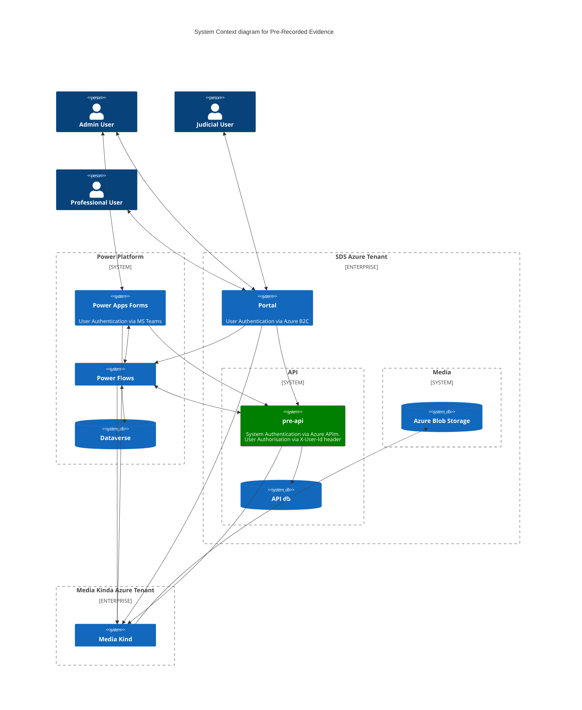

# Pre-Recorded Evidence API (pre-api)

[](https://opensource.org/licenses/MIT) [](https://sonarcloud.io/summary/new_code?id=uk.gov.hmcts.reform%3Apre-api) [](https://sonarcloud.io/summary/new_code?id=uk.gov.hmcts.reform%3Apre-api) [](https://sonarcloud.io/summary/new_code?id=uk.gov.hmcts.reform%3Apre-api) [](https://sonarcloud.io/summary/new_code?id=uk.gov.hmcts.reform%3Apre-api)

## Table of Contents

* [Introduction](#introduction)
  * [Intro to Pre-Recorded Evidence](#bulk-print)
  * [Purpose of pre-api](#send-letter-service)
  * [Documentation](#documentation)
  * [PRE System Diagram](#pre-system-diagram)
  * [Other PRE Repositories](#other-pre-repositories)
  * [What's inside](#whats-inside)
  * [Plugins](#plugins)
* [Building, Deploying and Running the Application Locally](#building-and-deploying-the-application-locally)
  * [Prerequisites](#prerequisites)
  * [Quick Start](#quick-start)
  * [Locally](#locally)
  * [Docker environment](#docker-environment)
* [Onboarding new services](#onboarding-new-services)
* [Manual Testing](#manual-testing)
* [License](#license)

## Introduction

### Intro to Pre-Recorded Evidence System

The Pre-Recorded Evidence (PRE) system is a new service that allows the capturing of a video recorded hearing or testimony,
and allows this recording to be securely shared to advocates, or played back in court. You can learn more about the service
[here](https://tools.hmcts.net/confluence/display/S28/Pre-Recorded+Evidence).

### Purpose of pre-api in the System

This code repository contains the source code for the Pre-Recorded Evidence API (pre-api).

pre-api is a Java Spring Boot application that serves as a backend API for both the PRE PowerApps Apps and the PRE Portal.

### Documentation

The API hosts numerous endpoints, which are [documented in Swagger](https://hmcts.github.io/cnp-api-docs/swagger.html?url=https://hmcts.github.io/cnp-api-docs/specs/pre-api.json#/).
If running PRE API locally you can access the Swagger UI at [http://localhost:4550/swagger-ui/index.html](http://localhost:4550/swagger-ui/index.html).

### PRE System Diagram

This diagram gives an overview of the PRE system which the pre-api connects to in its current state (not yet live).


### Other PRE Repositories
 * [PRE Power Platform Frontend](https://github.com/hmcts/pre-power-platform)
 * [PRE Shared Infrastructure](https://github.com/hmcts/pre-shared-infrastructure)
 * [PRE Function Apps](https://github.com/hmcts/pre-functions)
 * [PRE Portal](https://github.com/hmcts/pre-portal)

### What's inside

The template is a working application with a minimal setup. It contains:
 * application code
 * setup script to prepare project
 * common plugins and libraries
 * docker setup
 * automatically publishes API documentation to [hmcts/cnp-api-docs](https://github.com/hmcts/cnp-api-docs)
 * code quality tools already set up
 * MIT license and contribution information
 * Helm chart using chart-java.

The application exposes health endpoint (http://localhost:4550/health) and metrics endpoint
(http://localhost:4550/metrics).

## Plugins

The app code contains the following plugins:

  * checkstyle

    https://docs.gradle.org/current/userguide/checkstyle_plugin.html

    Performs code style checks on Java source files using Checkstyle and generates reports from these checks.
    The checks are included in gradle's *check* task (you can run them by executing `./gradlew check` command).

  * pmd

    https://docs.gradle.org/current/userguide/pmd_plugin.html

    Performs static code analysis to finds common programming flaws. Included in gradle `check` task.


  * jacoco

    https://docs.gradle.org/current/userguide/jacoco_plugin.html

    Provides code coverage metrics for Java code via integration with JaCoCo.
    You can create the report by running the following command:

    ```bash
      ./gradlew jacocoTestReport
    ```
    The report will be created in build/reports subdirectory in your project directory.
  * io.spring.dependency-management
    https://github.com/spring-gradle-plugins/dependency-management-plugin
    Provides Maven-like dependency management. Allows you to declare dependency management
    using `dependency 'groupId:artifactId:version'`
    or `dependency group:'group', name:'name', version:version'`.
  * org.springframework.boot
    http://projects.spring.io/spring-boot/
    Reduces the amount of work needed to create a Spring application
  * org.owasp.dependencycheck
    https://jeremylong.github.io/DependencyCheck/dependency-check-gradle/index.html
    Provides monitoring of the project's dependent libraries and creating a report
    of known vulnerable components that are included in the build. To run it
    execute `gradle dependencyCheck` command.

  * com.github.ben-manes.versions

    https://github.com/ben-manes/gradle-versions-plugin

    Provides a task to determine which dependencies have updates. Usage:

    ```bash
      ./gradlew dependencyUpdates -Drevision=release
    ```

## Building, Deploying and Running the Application Locally

### Prerequisites

#### Environment variables

> **Note** ℹ️
> pre-api requires many environment variables to be set in order to run. You can get an idea of what they are by looking at the
> `.env.local` file in the root of the project.
---

#### Setting Environment Variables

To run the application locally, you need to set several environment variables. Follow these steps:

1. **Create a `.env` file**
   In the root of the project, create a file named `.env`.

2. **Get the variable values**
   Ask one of the [PRE developers](https://github.com/orgs/hmcts/teams/pre-rec-evidence) for the required environment variable values and add them to your `.env` file.

3. **Load the variables**
   Run the following command in your terminal to load the variables from your `.env` file into your current shell session:

   ```bash
   export $(grep -v '^#' .env | xargs -0)
   ```

#### Why is this command needed?

This command loads all the environment variables defined in your `.env` file (ignoring any lines that start with `#`, which are comments)
and exports them into your current session. This makes the variables available to the application when you run it
Without the command, the application won't have the values it needs to function correctly.

### Building the application

> **Note** ℹ️
> The project uses [Gradle](https://gradle.org) as a build tool. It already contains
`./gradlew` wrapper script, so there's no need to install gradle.

To build the project execute the following command:

```bash
  ./gradlew build
```

### Running the Application with Docker

1. **Build the Docker image for database:**

   ```bash
   docker-compose build
   ```

    This command will build the Docker image for the database using the `docker-compose.yml` in the root of the project.

2. **Start the database the application needs:**

   ```bash
   docker-compose up --detach
   ```

   This will start the database container (in the background, hence the --detach). As well as the adminer container
which is a web interface for managing the database and can be used or ignored.

3. **Start the application itself:**

   ```bash
   ./gradlew bootRun
   ```

   This will start the application directly from the source cod (no need for JAR or image).
4. **Check if the application is running:**

   Call the health endpoint:

   ```bash
   curl http://localhost:4550/health
   ```

   You should see a response similar to:

   ```
   {"status":"UP","diskSpace":{"status":"UP","total":249644974080,"free":137188298752,"threshold":10485760}}
   ```
    This indicates that the application is running healthily.

## Running the Tests Locally

### Running the Unit Tests

#### With the Command Line

To run the unit tests with the command line, execute the following command:

```bash
  ./gradlew test
```

This will run all the unit tests in the project and generate a report in `build/reports/tests/test/index.html`.
You can open this file in your browser to see the test results.

#### With IntelliJ

Right-click on the `src/test` directory in IntelliJ and select "Run 'All Tests'". This will run all the unit tests in the project.
You can also run individual test classes or methods by right-clicking on them and selecting "Run".

### Running the Integration Tests

In order for integration tests to run, a docker image is needed for the
postgres testcontainers.

For this to pull from hmcts ACR you must login to the ACR first:
```bash
az login # if not logged in already
az acr login --name hmctspublic
```

### Running the Functional Tests

## How to generate a Power Platform Custom Connector
Copy the [Swagger v2 spec](https://raw.githubusercontent.com/hmcts/pre-api/master/pre-api-stg.yaml) and paste it into the [Power Platform Custom Connector](https://make.powerautomate.com/environments/3df85815-859a-e884-8b20-6a6dac1054a1/connections/custom) edit page. There will need to be a connector for prod and staging. The swagger spec is automatically updated in each PR.

```


## Crons

You can manually run a cron task from the cli:

```

TASK_NAME=[task] java -jar pre-api.jar run

# E.g.
TASK_NAME=CleanupLiveEvents java -jar pre-api.jar

# or
TASK_NAME=CleanupLiveEvents ./gradlew bootRun
```

## License

This project is licensed under the MIT License - see the [LICENSE](LICENSE) file for details

