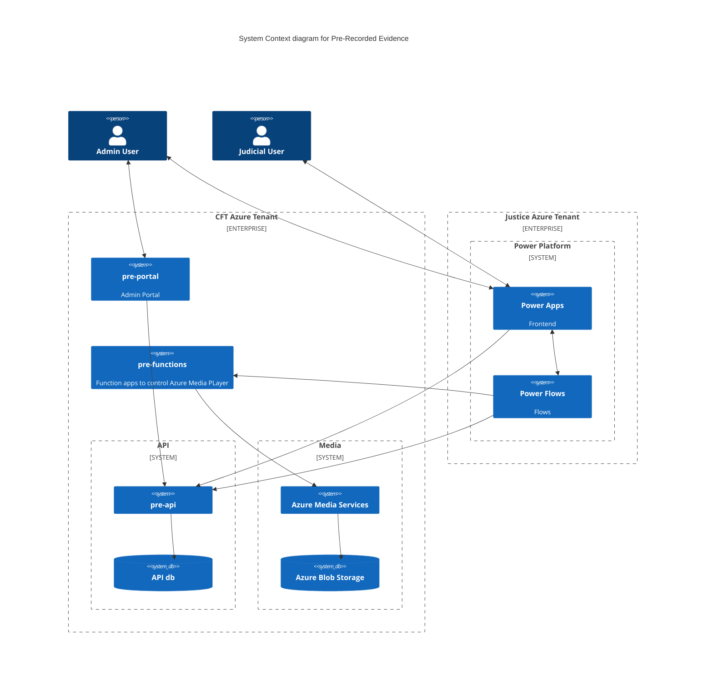

# pre-api

# Pre-Recorded Evidence API

[](https://opensource.org/licenses/MIT) [](https://sonarcloud.io/summary/new_code?id=uk.gov.hmcts.reform%3Apre-api) [](https://sonarcloud.io/summary/new_code?id=uk.gov.hmcts.reform%3Apre-api) [](https://sonarcloud.io/summary/new_code?id=uk.gov.hmcts.reform%3Apre-api) [](https://sonarcloud.io/summary/new_code?id=uk.gov.hmcts.reform%3Apre-api)

## Purpose

This code repository contains the source code for the Pre-Recorded Evidence API.

The API hosts numerous endpoints, [documented here](https://hmcts.github.io/cnp-api-docs/swagger.html?url=https://hmcts.github.io/cnp-api-docs/specs/pre-api.json#/)



## Related Repositories
 * [PRE Power Platform Frontend](https://github.com/hmcts/pre-power-platform)
 * [PRE Shared Infrastructure](https://github.com/hmcts/pre-shared-infrastructure)
 * [PRE Function Apps](https://github.com/hmcts/pre-functions)
 * [PRE Portal](https://github.com/hmcts/pre-portal)

## What's inside

The template is a working application with a minimal setup. It contains:
 * application code
 * setup script to prepare project
 * common plugins and libraries
 * docker setup
 * automatically publishes API documentation to [hmcts/cnp-api-docs](https://github.com/hmcts/cnp-api-docs)
 * code quality tools already set up
 * MIT license and contribution information
 * Helm chart using chart-java.

The application exposes health endpoint (http://localhost:4550/health) and metrics endpoint
(http://localhost:4550/metrics).

## Plugins

The template contains the following plugins:

  * checkstyle

    https://docs.gradle.org/current/userguide/checkstyle_plugin.html

    Performs code style checks on Java source files using Checkstyle and generates reports from these checks.
    The checks are included in gradle's *check* task (you can run them by executing `./gradlew check` command).

  * pmd

    https://docs.gradle.org/current/userguide/pmd_plugin.html

    Performs static code analysis to finds common programming flaws. Included in gradle `check` task.


  * jacoco

    https://docs.gradle.org/current/userguide/jacoco_plugin.html

    Provides code coverage metrics for Java code via integration with JaCoCo.
    You can create the report by running the following command:

    ```bash
      ./gradlew jacocoTestReport
    ```
    The report will be created in build/reports subdirectory in your project directory.
  * io.spring.dependency-management
    https://github.com/spring-gradle-plugins/dependency-management-plugin
    Provides Maven-like dependency management. Allows you to declare dependency management
    using `dependency 'groupId:artifactId:version'`
    or `dependency group:'group', name:'name', version:version'`.
  * org.springframework.boot
    http://projects.spring.io/spring-boot/
    Reduces the amount of work needed to create a Spring application
  * org.owasp.dependencycheck
    https://jeremylong.github.io/DependencyCheck/dependency-check-gradle/index.html
    Provides monitoring of the project's dependent libraries and creating a report
    of known vulnerable components that are included in the build. To run it
    execute `gradle dependencyCheck` command.

  * com.github.ben-manes.versions

    https://github.com/ben-manes/gradle-versions-plugin

    Provides a task to determine which dependencies have updates. Usage:

    ```bash
      ./gradlew dependencyUpdates -Drevision=release
    ```

## Setup

Located in `./bin/init.sh`. Simply run and follow the explanation how to execute it.

## Building and deploying the application

### Building the application

The project uses [Gradle](https://gradle.org) as a build tool. It already contains
`./gradlew` wrapper script, so there's no need to install gradle.

To build the project execute the following command:

```bash
  ./gradlew build
```

### Running the application

Create the image of the application by executing the following command:

```bash
  ./gradlew assemble
```

Create docker image:

```bash
  docker-compose build
```

Run the distribution (created in `build/install/pre-api` directory)
by executing the following command:

```bash
  docker-compose up
```

This will start the API container exposing the application's port
(set to `4550` in this template app).

In order to test if the application is up, you can call its health endpoint:

```bash
  curl http://localhost:4550/health
```

You should get a response similar to this:

```
  {"status":"UP","diskSpace":{"status":"UP","total":249644974080,"free":137188298752,"threshold":10485760}}
```

### Alternative script to run application

To skip all the setting up and building, just execute the following command:

```bash
./bin/run-in-docker.sh
```

For more information:

```bash
./bin/run-in-docker.sh -h
```

Script includes bare minimum environment variables necessary to start api instance. Whenever any variable is changed or any other script regarding docker image/container build, the suggested way to ensure all is cleaned up properly is by this command:

```bash
docker-compose rm
```

It clears stopped containers correctly. Might consider removing clutter of images too, especially the ones fiddled with:

```bash
docker images

docker image rm <image-id>
```

There is no need to remove postgres and java or similar core images.

## License

This project is licensed under the MIT License - see the [LICENSE](LICENSE) file for details

